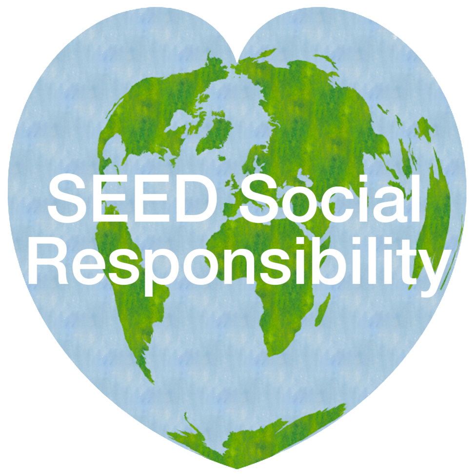

## History

Reading Black began as an idea by former Geography student Regan McDonald in 2020, supported by Jonny Huck, the SEED Director of Social Responsibility (2020-23). It was intended as a simple resource to foreground the work of non-white authors in subjects that are relevant to SEED. The project was revived in 2023 by Catherine Atkinson and Jonny Huck, again with the support of SEED Social Responsibility. 

## Contribute!

The lists available on the site were initialised by a small team of PGR students. The material listed so far is only intended as a starting point, we encourage all members of SEED to contribute to the lists either by making a pull request in [GitHub](https://github.com/SocialResponsibility/Reading.Black), or simply by sending suggestions to [sr.seed@manchester.ac.uk](mailto:sr.seed@manchester.ac.uk). Any academic works are acceptable (books, journal articles etc).

